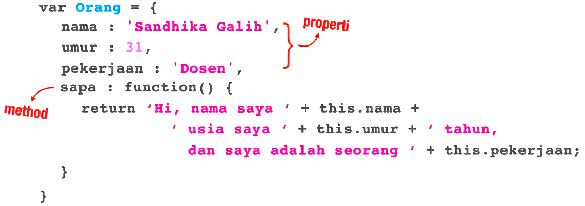

# Object

Object merupakan kumpulan nilai, yang memiliki nama. Berikut struktur object:

<br>

Berikut cara penulisan Properti dan Method dalam object:

```
let car = {
  //Property
  type: "Fiat",
  model: 500,
  color: "white",

  //method
  start: () => {
    console.log("start");
  },
  drive: () => {
    console.log("drive");
  },
  stop: () => {
    console.log("stop");
  },
};
```

Berikut cara memanggilnya

```
// properti
console.log(car.type); //Fiat
console.log(car.model); //500
console.log(car.color); //white

car.start(); //start
car.drive(); //drive
car.stop(); //stop
```

Object dapat dibuat dengan cara Object Literal, Function declaration, constructor function (keyword new) dan object.create()

### Object Literal

```
let shinobi1 = {
  name: "Uzumaki Naruto",
  "main jutsu": "kage bunshin no jutsu",
  secondJutsu: "Rasengan",
};

console.log(shinobi1.name); //Uzumaki Naruto
console.log(shinobi1["main jutsu"]); //kage bunshin no jutsu
console.log(shinobi1.secondJutsu); //Rasengan
```

Kekurangan object literal, saat kita akan membuat lebih dari satu object meskipun propertinya sama kita harus menuliskannya satu – satu.

### Function Declaration

```
let dataShinobi = (name, mainJutsu, secondJutsu) => {
  let shinobi = {};
  shinobi.name = name;
  shinobi["main jutsu"] = mainJutsu;
  shinobi.secondJutsu = secondJutsu;
  return shinobi;
};

console.log(dataShinobi("Uciha Sasuke", "Chidori", "Susanoo"));
//{ name: 'Uciha Sasuke', 'main jutsu': 'Chidori', secondJutsu: 'Susanoo'}

let naruto = dataShinobi("Uzumaki Naruto", "Kage bunshin no jutsu", "Rasengan");
console.log(naruto);
//{ name: 'Uzumaki Naruto', 'main jutsu': 'Kage bunshin no jutsu', secondJutsu: 'Rasengan'}
console.log(naruto.name); //Uzumaki Naruto
console.log(naruto["main jutsu"]); //Kage bunshin no jutsu
console.log(naruto.secondJutsu); // Rasengan
```

### Constructor Function (Keyword New)

Marupakan function yang dikhususkan untuk membuat object. Biasanya nama functionnya diawali dengan huruf besar untuk membedakan dengan funtion declaration. <br><br>
Cara membuatnya hampir sama dengan function declaration bedanya di constructor ada keyword this yang menggantikan nama object (var namaObject) serta tidak perlu mendeklarasikan variabel dan tidak perlu menambahkan return diakhir function. <br> <br>
Cara memanggilnya juga mirip bedanya di constructor harus menggunakan keyword new sebelum nama functionnya.

```
function Akatsuki(nama, mainJutsu, secondJutsu) {
  this.nama = nama;
  this.mainJutsu = mainJutsu;
  this.secondJutsu = secondJutsu;
}

let itachi = new Akatsuki("Uchiha Itachi", "Genjutsu", "Sharingan");
console.log(itachi);
//Akatsuki {nama: 'Uchiha Itachi', mainJutsu: 'Genjutsu', secondJutsu: 'Sharingan'}

console.log(new Akatsuki("Kisame", "Doton", "Suiton"));
//Akatsuki { nama: 'Kisame', mainJutsu: 'Doton', secondJutsu: 'Suiton' }
```

### For in Loop Object

For in di dalam object digunakan untuk mengurai/memetakan semua properti di dalam object. Berikut syntaxnya:

```
for (let variable in object) {
  // code to be executed
}
```

Berikut contoh penggunaanya:

```
const person = {
  fname: "John",
  lname: "Doe",
  age: 25,
};

let text = "";
for (let x in person) {
  text += person[x] + " ";
}
console.log(text); //John Doe 25
```

### Add Properties

```

const person2 = {
  fname: "John",
  lname: "Doe",
  age: 25,
};
console.log(person2); //{ fname: 'John', lname: 'Doe', age: 25 }

person2.nasionality = "english";
console.log(person2); //{ fname: 'John', lname: 'Doe', age: 25, nasionality: 'english' }
```

### Delete Properties

```
const person3 = {
fname: "John",
lname: "Doe",
age: 25,
eyeColor: "blue",
};
console.log(person3); //{ fname: 'John', lname: 'Doe', age: 25, eyeColor: 'blue' }

delete person3.eyeColor;
console.log(person3); //{ fname: 'John', lname: 'Doe', age: 25 }

delete person3["age"];
console.log(person3); //{ fname: 'John', lname: 'Doe' }
```

### Nested Objects

Nilai di dalam sebuah object dapat berupa object lain

```
myObj = {
  name: "John",
  age: 30,
  cars: {
    car1: "Ford",
    car2: "BMW",
    car3: "Fiat",
  },
};
```

Kita dapat mengaksesnya menggunakan menggunakan notasi dot atau braket.

```
console.log(myObj.cars.car1); //Ford
console.log(myObj.cars["car2"]); //BMW
console.log(myObj["cars"]["car3"]); //Fiat
```

Atau bisa juga dengan cara ini

```
let p1 = "cars";
let p2 = "car1";
console.log(myObj[p1][p2]); //Ford
```
